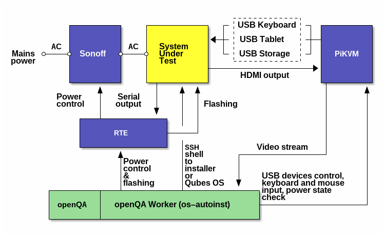

# Configurations for testing Qubes OS via PiKVM and RTE

.

* [msi](msi/README.md)

  - `ffmpeg`-based
  - stops `kvmd` on PiKVM for the duration of the test
  - manages input via `gadget-control` script
  - Kickstart configuration is served by PiKVM
  - installation is done from a drive mounted via OTG USB by `gadget-control`
    script
  - boots from the mounted drive
