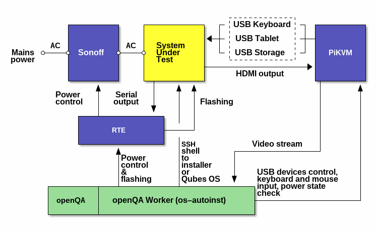

Below are instructions on adding a new platform similar to the one for OptiPlex.
Serves as documentation of the setup as well.

## Adding a new machine

At the time of writing IP address of openQA is accessible at
<http://192.168.4.32> (clicking login is enough, no password needed) and its
SSH can be reached at the same IP (see <https://pass.3mdeb.com/> for
`root`'s credentials).  Assuming that the IP will change at some later point
(when Proxmox is restarted for example), it's referenced below as `openqa`
which can be added in `/etc/hosts` to make URLs work without modification
(`workers.ini` part is an exception).

Throughout the text OptiPlex will be used as an example of a hardware platform.

Now that `os-autoinst` supports PiKVM's VNC, that's the go-to way of using
openQA as it consumes fewer resources, gets rid of `ffmpeg` hangs, can reuse OTG
part of PiKVM (at least for keyboard input, but for platforms that can see OTG
drives <https://docs.pikvm.org/msd/> should be useable through its REST API).

### Mental preparation

Things will fail to work because of hitting timeouts, hardware limitations,
software limitations, intermittent hardware or network failures.  Things will
fail to work even if they should work or did work recently...

To make it easier:

1. Go through starting an installer manually and make sure that works.
   Things can fall apart after innocuous changes like using a different ISO
   image, so don't hesitate to return to manual method when something goes
   wrong later in the process.  If necessary, uncomment `exit 0` in `power`
   script after the test has started to keep the machine running on failure or
   cancellation for manual inspection of its state.
2. Determine boot method (iPXE, GRUB, their interaction) and think how
   automation can repeat the steps you've done manually as reliably as possible.

### Add a new machine through openQA Web-UI

Go to <http://openqa/admin/machines> ("Machines" menu) and add a new machine:

 * name: `optiplex`
 * backend: `generalhw`
 * settings: `+WORKER_CLASS=optiplex`

### Add a new product through openQA Web-UI

Go to <http://openqa/admin/products> ("Medium types" menu) and add a new
product:

 * distri: `qubesos`
 * version: `4.2`
 * flavor: `install-iso-optiplex`
 * arch: `x86_64`

Just adding `-optiplex` suffix to be able to distinguish the product from
others.

### Add a new machine to job templates through openQA Web-UI

Go to <http://openqa/admin/job_templates/1> ("Job groups" menu) and add a new
entry to `products` and `scenarious` like below:

```yaml
# ...
products:
  # ...
  qubesos-4.2-install-iso-optiplex-x86_64:
    distri: qubesos
    flavor: install-iso-optiplex
    version: '4.2'
scenarios:
  x86_64:
    # ...
    qubesos-4.2-install-iso-optiplex-x86_64:
    - installation:
        machine: optiplex
    - aem-setup:
        machine: optiplex
    - aem-first-run:
        machine: optiplex
    - aem-second-run:
        machine: optiplex
```

This adds a product created in the previous
step (`qubesos-4.2-install-iso-optiplex-x86_64`) and associates it with test
suites to be run on `optiplex` machine.  This doesn't enforce ordering, see
<http://openqa/admin/test_suites> for `START_AFTER_TEST=...` defining
dependencies.

### Copy and edit generalhw scripts

Find a platform setup similar to the new one among
`/var/lib/openqa/share/tests/qubesos/generalhw-*` and use that as a base.

Example copy:

```bash
cp /var/lib/openqa/share/tests/qubesos/generalhw{-msi,-optiplex}
```

Changes to consider:

 * `sol` should be good as is for all cases
 * `flash` can:
  - flash firmware on DUT if necessary
  - mount ISO image to be used for network boot and prepare other related files
    in `/srv/www/openqa`
  - prepare PiKVM to serve as an OTG host
 * `input` can feed input to DUT if VNC isn't used
 * `power` generally deals with RTE and power status, but the latter conflicts
   with PiKVM, so things get a little complex and more complex if VNC isn't
   used
 * `ks.cfg` instructs Anaconda to prepare drive for installation by dropping
   partitions as the first step when the installer starts, so comment-out that
   part at first to not wipe the disk while starting testing the configuration
   (although if you got to `ks.cfg` execution, most things must already be
   working); the `fdisk` command might also need to be changed to prepare for
   Qubes installation

Most of IPs are set in worker's configuration but some files for network setup
*could* have hard-coded IP of openQA or DUT (grep for `192.168`).  There can
also be a placeholder replaced by `sed` with a real IP address automatically.

### Update handling of installation startup

`tests/install_startup.pm` of `openqa-tests-qubesos` is responsible for handling
host startup before system installation.  Knowing how you can start the
installer on a given platform see whether there is already a suitable option
which might need update of its conditional or add a new one if there isn't.

The `openqa-tests-qubesos` tests distribution is cloned at
`/var/lib/openqa/share/tests/qubesos/`.

### Add a new worker by editing /etc/openqa/workers.ini on openqa through SSH

Workers have numeric IDs which are used to start, stop or identify them.  It's
`WORKER_CLASS` which defines what kind of tasks will be dispatched to the
worker.

Configuration for generalhw that uses VNC for input and relise on network
boot (mostly handled in `install_startup.pm` mentioned above):

```
[4]
WORKER_CLASS = optiplex
# this makes "Developer mode" section of Live View tab work
WORKER_HOSTNAME = 192.168.4.32

GENERAL_HW_VNC_IP = 192.168.10.215
GENERAL_HW_VNC_JPEG = 1
GENERAL_HW_VNC_PASSWORD = admin

GENERAL_HW_CMD_DIR = /var/lib/openqa/share/tests/qubesos/generalhw/optiplex

GENERAL_HW_FLASH_CMD = flash
GENERAL_HW_FLASH_ARGS = 192.168.10.54 192.168.10.215

GENERAL_HW_POWERON_CMD = power
GENERAL_HW_POWERON_ARGS = 192.168.10.54 192.168.10.215 pon

GENERAL_HW_POWEROFF_CMD = power
GENERAL_HW_POWEROFF_ARGS = 192.168.10.54 192.168.10.215 poff

GENERAL_HW_SOL_CMD = sol
GENERAL_HW_SOL_ARGS = 192.168.10.54 13541

QUBES_OS_OPENQA_URL = http://192.168.4.32:8080
QUBES_OS_HOST_IP = 192.168.10.135
```

### Enable VNC service with a suitable authentication method on PiKVM

Edit `/etc/kvmd/override.yaml` to contain this (don't forget to do `rw` first):

```yaml
vnc:
    auth:
        vncauth:
            enabled: true # Enable auth via /etc/kvmd/vncpasswd
```

Then enable the VNC service:

```bash
systemctl enable --now kvmd-vnc
```

### Switch PiKVM to RGB24 video capture format

If needles don't match due to incorrect colors, that's probably because `UYVY`
format is used (see output of `v4l2-ctl --list-formats`).

In this case, copy `kvmd.streamer.cmd` part of `/etc/kvmd/main.yaml` to
`/etc/kvmd/override.yaml` and change `--format=` parameter to `RGB24`.  This
part will look like this:

```yaml
kvmd:
    streamer:
        cmd:
            - "/usr/bin/ustreamer"
            # ...
            - "--format=RGB24"
            # ...
```

Now, if colors are complete off now, that might be due to `RGB` being treated
as `BGR` or vice versa.  Need to patch `ustreamer`...

1. Clone [ustreamer].
2. Checkout tag that correspond to appropriate version, so it should be
   compatible with the rest of PiKVM.
3. Apply the following patch:

```patch
diff --git a/src/ustreamer/encoders/cpu/encoder.c b/src/ustreamer/encoders/cpu/encoder.c
index 1c20e6b..a56a7f2 100644
--- a/src/ustreamer/encoders/cpu/encoder.c
+++ b/src/ustreamer/encoders/cpu/encoder.c
@@ -221,15 +221,29 @@ static void _jpeg_write_scanlines_rgb565(struct jpeg_compress_struct *jpeg, cons
 }
 
 static void _jpeg_write_scanlines_rgb24(struct jpeg_compress_struct *jpeg, const us_frame_s *frame) {
+	uint8_t *line_buf;
+	US_CALLOC(line_buf, frame->width * 3);
+
 	const unsigned padding = us_frame_get_padding(frame);
 	uint8_t *data = frame->data;
 
 	while (jpeg->next_scanline < frame->height) {
-		JSAMPROW scanlines[1] = {data};
-		jpeg_write_scanlines(jpeg, scanlines, 1);
+		uint8_t *ptr = line_buf;
+
+		for (unsigned x = 0; x < frame->width; ++x) {
+			*(ptr++) = data[2];
+			*(ptr++) = data[1];
+			*(ptr++) = data[0];
 
-		data += (frame->width * 3) + padding;
+			data += 3;
+		}
+		data += padding;
+
+		JSAMPROW scanlines[1] = {line_buf};
+		jpeg_write_scanlines(jpeg, scanlines, 1);
 	}
+
+	free(line_buf);
 }
 
 #define JPEG_OUTPUT_BUFFER_SIZE ((size_t)4096)
```

4. Compile: `make apps`
5. Backup original: `cp /usr/bin/ustreamer{.bak}`
6. Install modified version: `cp src/ustreamer.bin /usr/bin/ustreamer`
7. Restart the service which executes `ustreamer`: `systemctl restart kvmd`

[ustreamer]: https://github.com/pikvm/ustreamer/

If PiKVM doesn't work after reboot, that means that video can't be captured at
large resolution in `RGB24` format, so create a service that loads EDID on
startup.  Make `/etc/systemd/system/hdmi-init-edid.service`:

```
[Unit]
Description=EDID loader (1024x768 resolution)
Wants=dev-video0.device
After=dev-video0.device systemd-modules-load.service

[Service]
Type=oneshot
ExecStart=/usr/bin/v4l2-ctl --device=/dev/video0 --set-edid file=/root/openqa/edid.1024x768
ExecStop=/usr/bin/v4l2-ctl --device=/dev/video0 --clear-edid
RemainAfterExit=true

[Install]
WantedBy=multi-user.target
```

See <https://blog.3mdeb.com/2023/2023-12-22-qubesos-hw-testing/> for how to make
an EDID for 1024x768 resolution (shortcut: if original EDID on two PiKVMs match,
can just reuse updated one instead of editing it).

Enable the service (stop `kvmd` service first if you want EDID to apply right
away, otherwise drop `--now` and reboot):

```
systemctl enable --now hdmi-init-edid
```

### Enable and start the worker

```
systemctl enable --now openqa-worker@4
```

### Start the job

While logged into openQA server (unless you've installed and configured
`openqa-cli` locally):

Perform installation followed by AEM testing:

```
openqa-cli api -X POST isos DISTRI=qubesos VERSION=4.2 ARCH=x86_64 BUILD=4.2.0 FLAVOR=install-iso-optiplex
```

ISO name is generated as `ISO=Qubes-R%BUILD%-%ARCH%.iso`, you should also create
a symlink to it in `hdd` directory.  Only Fedora template is going to be
installed to make setup faster.

Output like

```
{"count":4,"failed":[],"ids":[448,449,450,451],"scheduled_product_id":59}
```

means the jobs (`4` in this case) were scheduled successfully.

Use "Dependencies" tab to see jobs which are part of the same run.

#### Parameters

These settings can be added to `openqa-cli` posting command to specify which
packages to use.  Current default uses
<https://dl.3mdeb.com/open-source-firmware/QubesOS/trenchboot_aem_v0.3/>.

* `PACKAGES_BASE_URL` - where to look for AEM-related packages.
* `AEM_VER` - version of `anti-evil-maid` package
* `GRUB_VER` - version of `grub2-*` packages
* `XEN_VER` - version of `xen-*` packages

### Verify the job

Because things sometimes don't work as expected, it's better to check that it
was able to start instead of incorrectly assuming that it did and seeing a quick
failure after coming back in half an hour.

Go to <http://openqa/tests>, open the running job and see that video is there
maybe in a minute or two after starting the job.  Restart the job if it has
failed to start for no good reason or video isn't working.
